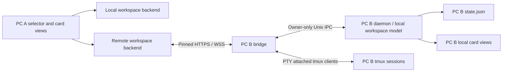

# PC-to-PC SUPER DESKTOP implementation plan

Status: implementation started; the complete feature is not yet available.
Prepared 2026-09-21 against the current repository.

Implementation has started: see [increment status and protocol notes](REMOTE_DESKTOP_PROTOCOL.md).
The original architecture below remains the target. Capability negotiation,
the isolated PTY prototype, the daemon-owned local state, persisted terminal order
and authenticated workspace snapshot/event routes are implemented. Lifecycle
mutation extraction, remote commands, outgoing peer connections, the selector and
network terminal transport remain pending.

## 1. Intended experience and scope

Add another PC (the requested “slave”) as a **Remote PC**. Each installation can
both host its own workspace and connect to other installations. There is no
permanent master/slave mode and no automatic reciprocal authorization.

- Put a machine selector at the far left of the top dock, before the brand and
  workspace folder. Default to **This PC · <hostname>** on every daemon startup.
- Offer paired PCs with connecting/online/offline/approval-required states, plus
  **Add PC…** and **Manage PCs…**. Remember the selection across overlay hide/show,
  but do not restore a remote selection after restarting the application.
- Selecting a PC shows that PC's terminal/harness cards, positions, sizes, tags,
  iconified state, and live interactive terminals. The folder picker and harness
  launch buttons use that PC's folders and installed harnesses.
- Typing, pasting, interrupting commands, and using terminal applications act on
  the selected PC. Creating or closing a terminal also acts on that PC.
- Dragging/resizing/iconifying a remote card updates its layout on the host PC.
  Local changes on the host appear on the viewer. Merely viewing or fitting a
  workspace to another screen must never rearrange the host's cards.
- Switching PCs leaves every harness running and restores the previous local
  workspace intact. An offline selected PC stays selected with disabled input
  and a visible disconnected state; never silently fall back to local input.

First release targets the existing Linux GTK/VTE/Hyprland application on both
machines, over LAN or Tailscale. “Desktop” means the SUPER DESKTOP workspace,
not arbitrary OS windows, a video stream, remote login, or file synchronization.
The target PC must run its daemon and bridge. Existing Android clients must keep
working without re-pairing solely because this feature was installed.

Notes are deferred in the first release: show only the selected host's terminals,
hide local notes in remote mode, and disable remote New Note with an explanation.
Do not silently create local notes while viewing a remote PC. Remote file previews
and image prompts are a follow-up; hide/disable those buttons until routed through
the authenticated host APIs. Full terminal interaction is required for release;
a snapshot-only prototype does not complete this feature.

## 2. What exists and where to change it

| Existing code | Relevant behavior / implication |
| --- | --- |
| `src/window.rs` | Owns the GTK Fixed canvas, top dock, card lifecycle, geometry callbacks, and workspace controls. Currently assumes all cards are local. |
| `src/mini_terminal.rs` | VTE widgets spawn local tmux attaches; session preparation can create/resume local harnesses. Remote cards must never enter this path. Has separate detach and close-session operations. |
| `src/state.rs` | `TerminalData` persists card geometry, restored size, icon position, tag, session name and working directory. No host identity, layout revision, canvas metadata, or persisted stacking order. |
| `src/main.rs` | Daemon and Unix IPC command dispatch. Several create operations call `show_window`; remote operations need host-state access without selecting/showing the host overlay. |
| `src/bridge.rs` | Separate bridge process; TLS/WSS, persistent bridge ID, harness list, create/delete, workspaces and installed harness endpoints. `collect_harnesses` combines persisted metadata with live tmux sessions, without card geometry. |
| `src/bridge_pairing.rs`, `src/bridge_security.rs` | Invitation, host approval, token hashes, certificate identity, Unix-only administration, revocation and connection bounds. Reuse these trust rules. |
| `src/tmux_control.rs` | Phone control client uses `ignore-size,no-output`, captures styled pane snapshots and sends input. It is not a full terminal byte transport. |
| `src/ws.rs` | Small server-oriented WebSocket implementation. Its decoder requires masked client frames; it cannot be reused unchanged to read unmasked server frames as a client. |
| `src/launcher_settings.rs`, `src/workspace_bar.rs` | Pairing/settings and folder UI integration points. |
| `SECURITY.md`, `tests/bridge_security_smoke.py` | Existing security contract and isolated bridge regression coverage. |

Important details to preserve:

- The current bridge security protocol is v3 even though routes use `/api/v1`.
  Some bridge source comments still describe loopback exceptions; actual security
  uses owner-only Unix control and no network loopback authentication bypass.
- Current terminal streams send `tail`/`tailAnsi` snapshots. Feeding these
  repeatedly into VTE would duplicate text and lose cursor/application state.
- Current geometry uses the first monitor and minimum dimensions of 1920×1080
  in `window.rs`. Define actual logical canvas bounds before promising matching
  layouts on smaller monitors. Multi-monitor placement is not currently modeled.
- Card identity (`TerminalData.id`) and tmux session name are separate concepts;
  the existing harness API exposes the session name as its `id`.

## 3. Architecture and ownership

Use the bridge as the network boundary and the owning desktop daemon as the
authority for its local workspace. A viewer renders remote state and sends typed
commands; it never writes remote cards into its own `AppState.terminals`.

Introduce a small backend boundary for workspace snapshot/subscription, create,
close, layout updates, folder queries and terminal attach. Keep presentation
(card chrome, drag/resize, status labels) reusable, with distinct local and remote
terminal attachment implementations. Do not perform a wholesale UI rewrite.

Separate the daemon's **local workspace model** from its **selected view**. This
is essential: if B is viewing C, a request from A to B must still operate on B's
local workspace. Existing CLI commands and Android endpoints also remain bound
to their own daemon's local machine. Never proxy requests transitively to the
selected peer, and never expose outgoing peer credentials or peer catalogs.

Key every client-side object by `(machine_id, card_id)`, with an explicit mapping
to `session_name`. Use the existing persistent bridge ID for network machine
identity, bound to its certificate pin; display names and addresses are not IDs.
Use a separate Local enum variant so local operation never requires the bridge.

All network, filesystem and blocking tmux work runs off the GTK thread. Deliver
bounded model updates to GTK. Every asynchronous result carries machine identity
and a selection generation; discard stale results after a switch. Cancel pending
drags, focus, queued input and attach operations when selection changes.

## 4. Pairing, discovery, and persistence

1. On B, use the existing secure invitation UI and copy its pairing link.
2. On A, choose Add PC and paste the link. Parse and validate it without opening
   arbitrary URLs or treating a discovered address as trusted.
3. Connect with the invitation's certificate pin; allow a manual LAN/Tailscale
   address override while keeping that pin. No HTTP fallback or redirects.
4. Reuse the invitation-gated pairing request/poll flow. Show A's device name
   and verification code on both PCs; B's user explicitly approves on B.
5. Store B's bridge ID, pin, credential expiry, label and routes; add B to the
   selector. Never approve pairing through a remote terminal-management API.

Manual invitation entry is sufficient for the first release. Existing mDNS
`_omarchy-harness._tcp` discovery can later suggest routes; it must not establish
trust. Deduplicate routes by the verified bridge ID. Reject self-pairing.

Store outgoing peers separately from local workspace state and incoming paired
devices, e.g. `~/.local/state/super-desktop/peers.json`, with a 0700 directory,
0600 file, atomic replacement and no secrets in logs, process arguments, URLs,
clipboard exports, or `state.json`. Prefer a desktop secret store if available;
the first-release fallback may be a private credential file under the same-user
trust boundary, explicitly documented as unencrypted at rest. Store only metadata
in any exportable preferences. Tokens are necessarily recoverable on the client;
the server continues storing only hashes.

Distinguish **Forget on this PC** from **Revoke on the host**. Reuse the host's
registered-device revocation UI, generalized from phones to devices. Revocation
must close live layout and terminal streams and reap their tmux attach clients.
Expiry requires pairing again. A changed certificate or unexpected bridge ID
blocks connection and requires a fresh trusted invitation, never silent trust.

## 5. Proposed desktop protocol

Keep existing Android response shapes and endpoint semantics. Negotiate an
additive authenticated capability document, for example
`GET /api/v1/desktop/capabilities`, containing bridge ID, desktop API version and
capabilities `workspace-layout-v1` and `terminal-pty-v1`. A 404 or missing required
capability yields “Update SUPER DESKTOP on this PC”; never pretend phone snapshots
provide full desktop support. Do not bump security protocol v3 for additive APIs.

Proposed endpoints (freeze exact schemas in phase 1):

| Endpoint | Purpose |
| --- | --- |
| `GET /api/v1/desktop/workspace` | Authoritative local-workspace snapshot from the host daemon. |
| `GET /api/v1/desktop/events` (WSS) | Initial snapshot, then ordered workspace updates, removals and host availability. |
| `POST /api/v1/desktop/commands` | Typed create, close, layout/tag/iconify and default-folder commands, with request IDs and revisions. |
| `GET /api/v1/desktop/terminals/<card-id>/attach` (WSS) | New bidirectional PTY transport. Resolve to an owned session on the server. |

Reuse existing authenticated workspace/harness-type endpoints where their
semantics fit. New desktop mutations should use the command envelope so create
and close can reconcile uncertain results; preserve Android's existing endpoints.

Snapshot schema must explicitly include:

- `machineId`, fresh daemon `epoch`, monotonically increasing `revision`.
- Logical canvas origin, width, height, scale information and usable dock inset.
  First release describes the current single overlay canvas, not invented
  multi-monitor coordinates.
- Current default folder, remote display/home metadata, configured visible
  harnesses and available harness types.
- Cards with `cardId`, `sessionName`, `agentType`, title/status, workspace directory,
  tag, x/y/width/height, restored width/height, iconified/iconX/iconY, per-card
  revision and stacking order. Include tmux cell dimensions for attachments.
- Saved cards whose sessions have exited, rather than silently dropping them;
  distinguish a live session, a missing session and a deleted card. Unmanaged
  tmux sessions in the phone list have no desktop placement and are excluded.

Export purpose-built DTOs, not raw `AppState` or arbitrary launch command strings.
Initialize subscriptions with an atomic snapshot plus revision; subscribe before
collecting or retain updates so no mutation is lost between snapshot and stream.
On a revision gap, reconnect or changed epoch, discard incremental assumptions
and obtain a fresh snapshot. Full snapshots are acceptable initially if bounded
and sent only on changes; don't poll and parse `state.json` for interactive layout.

Commands carry `requestId`, `machineId`, `expectedEpoch`, target card identity and
expected card revision where applicable. Validate allowed fields and bounds.
Apply through structured Unix IPC to the owning model, with a typed success or
error reply and resulting revision. No shell command interpolation, arbitrary
tmux targets or remote access to local administrative IPC.

Serialize mutations on the host model. Persist accepted layout/lifecycle changes
before reporting them durably committed. Local gestures use the same revision
mechanism. Submit drag/resize at gesture end (optional throttled previews later);
reject a stale edit with conflict and current geometry instead of overwriting a
concurrent edit. Closing a card wins over an in-flight drag.

Use a bounded per-device request-result cache for mutation deduplication within
one daemon epoch. Never automatically replay create/close after an epoch change
or an ambiguous timeout; refresh state and show an uncertain outcome. Persisting
deduplication across crashes is a later improvement, not an exactly-once claim.
Terminal keystrokes are never replayed after disconnect.

## 6. Full interactive terminal transport — first technical milestone

Prototype this before broad UI refactoring. Reuse the owning tmux session, but
create a **dedicated tmux attach client on a server-side PTY** for each remote
terminal view. Bridge PTY bytes over authenticated WSS into a local VTE attached
to a local proxy PTY/helper. The helper has no local shell or harness session:
it only forwards bytes and control messages. Pass its connection/credential
through a private inherited descriptor, not argv or environment variables.

This path lets VTE handle terminal emulation, input methods, control keys,
alternate screen, cursor state, paste and mouse sequences. Attaching tmux should
produce a full initial redraw; reconnect uses a new attach and fresh redraw,
not replayed old output. A tmux control-mode byte adapter is an alternative only
if a prototype proves equivalent redraw and interaction behavior.

Define a versioned attach handshake, server-ready response, binary data frames,
terminal size/control messages, close reasons and heartbeats. Send no user input
until the attachment is ready for the currently selected machine. Set terminal
type/color environment consistently with local VTE. Size both ends' proxy PTYs
consistently and validate behavior on the installed tmux/VTE versions.

**Sizing policy:** the host owns the session's terminal cell grid. Remote attach
clients must not enter tmux's normal smallest-client sizing arbitration: use
`ignore-size` or a verified equivalent. Viewer screen fitting changes presentation
only. Match the remote VTE grid to host rows/columns, using zoom/scrollable viewport
as necessary; report host grid changes to every viewer. An explicit remote card
resize updates the host layout, then the host computes/applies the new grid,
including while its overlay is hidden and no local VTE is attached. Establish
one grid authority so local and remote clients cannot continually resize each
other. Prototype redraw and resize ordering; do not silently crop output or
force every session to the viewer's screen dimensions.

Terminals are shared sessions. Concurrent local/remote/phone input may interleave;
show remote connection presence and document shared control. An exclusive control
lease is deferred. Preserve the image-prompt input guard: raw terminal input must
not bypass an in-progress guarded prompt transaction. Centralize per-session
remote input arbitration; never buffer user keys to replay later after a busy
transaction or disconnected transport.

Disconnect/switch/hide destroys only that view's attach client and proxy, never
the session or harness process. Explicit Close is the separate host operation.
The existing “one tmux client per card” invariant becomes one owning local client
plus bounded remote view clients; verify `detach-on-destroy` behavior and ensure
no attach uses a flag that detaches other users.

Use a client-capable HTTP/WSS implementation with rustls pin verification, server
frame decoding and client masking; do not invert the existing server decoder.
Prefer a maintained library over expanding custom framing. Retain TLS signature
verification in any pin verifier and preserve server authorization on every
stream. Choose exact crate versions during implementation, not from this plan.

Keep the existing 64 global / 12 per-source connection limits initially. Budget
one workspace stream, at most eight attached remote terminals per selected peer,
and room for commands/pairing/phone traffic. Prioritize focused/visible cards;
show unattached previews with click-to-attach when over budget. Apply bounded
byte queues (initially 1 MiB per attachment), frame chunks within existing 16 KiB
limits, timeouts, backpressure and explicit overflow disconnect. Never drop
arbitrary terminal bytes and continue with a corrupted display. Reuse or extend
revocation checks to cover PTY forwarding and process teardown.

## 7. Layout fidelity and screen differences

Host coordinates are authoritative **logical** pixels, not physical display
pixels. On equal usable canvas sizes, render the same rectangles and order.
Persist stacking order with migration defaults. Publish current expanded state
if available, but keep it distinct from saved/restored geometry: expansion is
currently transient and must not accidentally overwrite the saved card rectangle.

Default remote view to **Fit workspace**. For host usable rectangle `(hx,hy,Hw,Hh)`
and viewer usable rectangle `(vx,vy,Vw,Vh)`, use
`s = min(1, Vw/Hw, Vh/Hh)` and centered offsets. Display a host point as
`(vx + (Vw-s*Hw)/2 + s*(x-hx), vy + (Vh-s*Hh)/2 + s*(y-hy))`.
Apply the same transform to sizes and hit-testing; invert it for user drags before
sending integer host coordinates. Round only at commit and enforce bounds on the
host. Account for dock space once, not separately in each widget.

GTK/VTE font/layout scaling may prevent exact pixel equivalence. Provide a
**100% + pan/scroll** mode when fitted terminals become unreadable or cannot
preserve the host grid. Test the transform against actual GTK allocation and
input coordinates. Never persist fitted coordinates, silently auto-arrange, or
resize the host because the viewer monitor changes. Use the viewer's theme for
the first release; matching font metrics and colors exactly is not guaranteed.
Multi-monitor topology mirroring is deferred; do not add meaningless monitor IDs
without implementing their coordinate semantics.

## 8. UI actions, lifecycle, and failure behavior

Audit every toolbar button, keyboard shortcut, card callback and background job:

| Action | While a remote PC is selected |
| --- | --- |
| New terminal / Ctrl+T / harness buttons | Create on selected host using its installed harnesses and validated folder. |
| Folder picker/search/history | Query/validate/remember on selected host. Never probe its path on the viewer filesystem or expand `~` locally. |
| Drag, resize, tag, iconify, expand, arrange | Route to host model with appropriate revision; arrange only supported terminal cards in remote mode. |
| Close card | Explicitly close on named remote host; never run a local `kill_session`. |
| Esc, toggle, hot corner | Control this viewer's overlay. |
| Settings / shortcut / sleep lock / theme | Remain clearly labeled local settings. Peer management is local; do not expose remote OS settings. |
| Notes / Files / image attachment | Disabled/hidden until their remote implementation exists. |

Selecting a host freezes outgoing input before detaching old views, increments
the selection generation, cancels old requests and populates the new snapshot.
Restore local views without recreating sessions. Outbound selection never changes
what this machine serves to its own incoming clients.

On disconnect, disable input immediately, mark snapshots stale, cancel pending
gestures, and retain the selected host label. Reconnect with bounded exponential
backoff and jitter, verify identity, refresh capabilities/snapshot and attach anew.
Do not reconnect automatically after revocation, expiry, pin mismatch or explicit
Forget. A sleeping PC is offline; wake-on-LAN and relay/NAT traversal are deferred.

When the viewer overlay is hidden, release its terminal streams and retain at
most lightweight workspace/status monitoring. Inactive peers use bounded,
low-frequency checks rather than terminal streams; cap monitoring concurrency.
The local workspace model continues serving incoming clients when hidden or
while viewing another machine. If the host daemon is down but its bridge lives,
return a distinct `desktop_unavailable`, not an empty workspace.

## 9. Implementation sequence and handoff boundaries

Each phase should be a separately reviewable change. All phases through 7 are
required for the first release; follow-ups in section 1 are separate work.

1. **Contracts and terminal feasibility.** Define DTOs, identity, IPC contracts,
   capability schema and errors in a proposed `src/desktop_protocol.rs`. Build
   an isolated PTY/WSS/VTE proof with one shell and one full-screen terminal app.
   Prove grid ownership, mouse/paste, redraw/reconnect, revocation and clean
   detach with two viewers. Resolve technical failures before building the UI.
2. **Local model boundary.** Extract authoritative local workspace operations
   from `window.rs` into a proposed `src/workspace_model.rs`; add revisions,
   canvas metadata, stacking migration and structured IPC in `main.rs`. Keep
   local UI behavior and CLI/Android targeting intact. Ensure create/resize works
   while hidden without forcibly showing the host overlay.
3. **Desktop bridge APIs.** Add snapshot/events/commands in a proposed
   `src/desktop_bridge.rs`, reusing bridge authentication, limits and owner IPC.
   Add capability negotiation, epoch reconciliation and mutation deduplication.
   Integrate the validated PTY server in `src/terminal_transport.rs` or equivalent.
4. **Peer client and registry.** Add proposed `src/peer_client.rs` and
   `src/peer_store.rs`: invitation pairing, pinned HTTP/WSS, private credentials,
   version checks, connection state, cancellation and reconnect. Test without GTK.
5. **Selector and remote card view.** Add proposed `src/machine_selector.rs` and
   backend/view boundary; reuse card chrome while keeping remote attachments
   away from local session preparation. Implement top-left selector, Add/Manage,
   routed controls, disconnected UI and guarded asynchronous callbacks.
6. **Layout and simultaneous use.** Implement fit/100% modes, inverse drag
   transform, revision conflicts, host-owned grids, local/remote updates and
   stream budgeting. Verify B can view C while A operates B, and A/B can view
   each other without recursion or exported peer state.
7. **Regression, documentation and release.** Complete the matrix below, update
   README and SECURITY (device terminology, outgoing credentials, new routes,
   resource limits), and document known limits and recovery. Include an actual
   two-PC walkthrough and measured performance results in the implementation PR.

Suggested file names are boundaries, not a requirement to create empty modules.
Before each phase, inspect the preceding implementation and tests; do not treat
this document's proposed APIs as already existing.

## 10. Verification and release acceptance

Automated coverage must test behavior across boundaries, especially:

- Legacy `state.json` loads unchanged; peer state never pollutes local cards;
  identities remain unique when two PCs have equal card IDs/session names.
- Pinned TLS, expired invitations, denial, duplicate routes, self-pairing,
  token expiry, changed certificates, immediate revocation, auth on every new
  endpoint, malformed frames and bounded queues. Isolate test state/ports.
- Snapshot/subscription race, gaps and epoch changes; concurrent move/close;
  deduplicated create; uncertain mutations never blindly retried.
- Terminal UTF-8 across frame boundaries, control keys, IME, multiline bracketed
  paste, mouse, alternate screen, color, reconnect redraw, size changes,
  slow reader and abrupt disconnect. Session PID survives detach/switch/hide.
- Stale results after A→B→A cannot attach to, close, resize or send input to the
  wrong host. Incoming bridge and local CLI stay local regardless of selection.
- Geometry round trips on equal/different aspect ratios, fractional display
  scales, small screens, icon positions, restored dimensions and docking insets.

Manual acceptance matrix:

| Scenario | Required result |
| --- | --- |
| Fresh start and upgrade | This PC selected; original local cards and behavior intact. |
| Pair A→B and A→C | Both PCs selectable with verified identities; reverse access needs separate pairing. |
| Equal-sized displays | Host positions, card sizes, icon state and order match. |
| Different sizes/scales | Fit or 100% view is usable; all cards reachable; viewing never writes layout back. |
| Shell + installed harness + full-screen app | Real interactive terminals, copy/paste and interrupt work; no snapshot artifacts. |
| Drag/resize from either machine | Other view updates; conflicts visible; no resizing oscillation. |
| Create/close on B from A | B owns the lifecycle and folder; A's local state is unchanged. |
| Rapid switching and hide/show | No keys reach the wrong PC and no harness is killed. |
| B asleep, bridge restart, daemon restart | Clear stale/offline state; safe refresh; no duplicate commands. |
| Android plus desktop viewers | Existing phone pairing/list/input/files remain compatible. |
| B views C while A views B | A sees and controls B's local workspace, never C's. |
| Revoke A on B | Streams close promptly; A cannot keep typing; B's sessions survive. |

Run `cargo test --bin super-desktop`, isolated bridge smoke tests (extend
`tests/bridge_security_smoke.py` or add a desktop-specific companion), and the
repository-prescribed `./rebuild.sh --no-daemon` for build-only validation. Use
`./rebuild.sh` only when deliberately installing/restarting for manual testing;
do not disturb live sessions to execute automated tests.

Record input-to-display latency and idle CPU/network usage for one, four and
eight visible terminals, plus repeated switch/reconnect cycles. Initial LAN
target: p95 echo latency below 100 ms on an unloaded wired network; report hardware
and conditions rather than treating this as an Internet guarantee. Require bounded
memory, file descriptors and attach-client counts after repeated disconnects, and
no regression in local overlay responsiveness with every peer offline.

The feature is complete when a user can pair two PCs, select either workspace,
recognize its layout, work interactively in its existing harnesses, and return
to local work without losing sessions or sending actions to the wrong machine.
