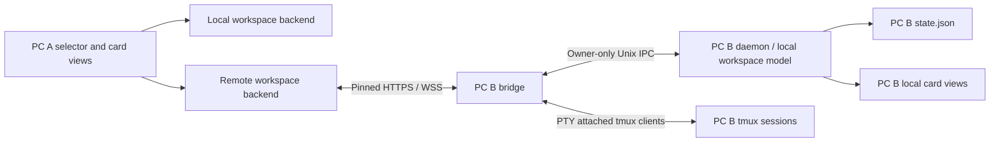

# PC-to-PC SUPER DESKTOP implementation plan

Status: pairing, a live remote workspace, its terminal transport, viewer typing
and the host's own harness bar, folder picker and card chrome are delivered, and
both workspaces now run the *same* UI code with only the source swapped; the
100% + pan/zoom mode, conflict feedback and live outgoing subscriptions remain in
progress.
Updated 2026-09-22 against `master`.

Implementation has started: see [increment status and protocol notes](REMOTE_DESKTOP_PROTOCOL.md).
The original architecture below remains the target. Capability negotiation,
the daemon-owned local state, persisted terminal order, authenticated workspace
snapshot/event routes and the host-side PTY attach transport with a host-owned
grid are implemented. Outgoing certificate-pinned PC pairing, private peer
storage, remote snapshot retrieval and a `peer-attach` streaming CLI are testable
through the CLI, and the top-left selector renders the host's consoles live at
their own positions and sizes. Typing into a focused remote console reaches
that host session after the attach handshake, and
`POST /api/v1/desktop/commands` applies typed layout, close and create commands
with epoch/revision checks and per-device deduplication. While a remote PC is
selected its top bar offers that PC's own harness buttons, and a click launches
that harness there. Default folder selection, the viewer's own close/resize and
iconify controls, the 100% + pan/zoom mode, live outgoing workspace
subscriptions and the two-PC regression matrix remain pending.

## Current delivery status

The following is present on `master` and has been rebuilt/tested between two
PCs:

- The top-left **This PC** selector defaults to the local machine and retains a
  selected remote PC while the overlay is hidden. Restarting the daemon returns
  to the local machine.
- **Add a PC** supports both directions in one Omarchy-styled panel: create and
  copy a one-time connection link to share this PC, or paste a link created on
  the other PC to connect this PC. Approval and the verification code still
  happen on the host PC.
- Approved, certificate-pinned peers are stored privately and appear in the
  selector. The viewer polls the host's authenticated workspace snapshot and
  draws terminal cards in their host positions, sizes, iconified positions and
  stacking order, scaled to fit the viewer canvas and never enlarged.
- Dragging a remote card's header moves and raises it on the host: the gesture
  ends with one typed `POST /api/v1/desktop/commands` (`setLayout`) that carries
  the card revision the viewer drew, so a concurrent host edit is answered with
  `conflict` and the host's own geometry instead of being overwritten. The same
  command route applies resize, iconify and `closeTerminal` on the host; the
  viewer's own edge-resize and close/iconify controls are the next milestone. A
  card the host shows expanded, or a host that does not advertise
  `workspace-layout-v1`, keeps its own layout.
- **One UI, two sources.** A remote workspace is drawn by the same two widgets a
  local one is: `src/harness_bar.rs` owns the harness bar (buttons, labels,
  logos, tooltips, order and the launch line) and `src/mini_terminal.rs` owns the
  card (chrome, header buttons, drag, resize, expand and close). The only
  difference is the source they are given (`src/card_source.rs`): this machine's
  tmux and `state.json`, or a host's streamed session and its snapshot. A remote
  workspace's top bar is therefore the local one, showing the host's own harness
  list in the host's order, and its consoles carry the same buttons.
- Every remote control acts **on the host**, and the viewer mirrors the host's
  snapshot: minimize, maximize, close and resize are one typed command each
  (`setLayout`, `setExpanded`, `closeTerminal`), carrying the card revision this
  view drew, so a concurrent host edit is refused with the host's own geometry
  instead of being overwritten. A card's click-raise is local until the host's
  own stacking order changes.
- Clicking a harness button sends a typed `createTerminal` command and the host
  builds the card exactly like a local launch — its own inventory, sandbox flags
  and folder — without being forced to show its overlay. The bar is offered only
  by a host that advertises `workspace-layout-v1`, is inert while a launch is in
  flight, and names only harnesses and folders that host published.
- The folder new harnesses start in is the local control, fed by the host: the
  snapshot publishes the folders that host offers, the viewer lists them, and
  picking one sends `setWorkspace` (judged against the workspace revision). The
  same list is the permission, so a create may name any folder in it — which is
  what lets a folder be picked and used without waiting for the next snapshot.
- Each visible remote console is a real VTE terminal fed by the host's own tmux
  attach output over pinned WSS (`GET /api/v1/desktop/terminals/<card-id>/attach`),
  so output, colours, alternate-screen applications and redraws match the host.
  The host attaches at the grid it already owns, which is what keeps a viewer
  from resizing the host's panes, and pushes `grid` frames when that grid
  changes. Attachments are bounded (8 per credential, 16 per bridge), end on
  revocation and are released when the overlay is hidden.
- The Android bridge's connection-link popover is compact. Closing the
  selector popover no longer cancels an already submitted pairing request.
- `./rebuild.sh` now stops both the desktop daemon and its separate
  `harness-bridge` process before restarting. This is required because an old
  bridge can otherwise keep serving port 8759 and return a 404 for the desktop
  capability route after the source has been updated.

This is a **live view you can type into, rearrange and launch from**: the same
widgets as a local workspace, with a host on the other end. It shows the host's
terminal pixels, sends keystrokes, paste and Ctrl+C to the focused session, and
its cards' own buttons, drags and edges move, resize, iconify, expand and close
the host's cards, and the folder beside its top bar lists the folders *that PC*
offers, so a new harness there can start in any of them. What is still missing is
the 100% + pan/zoom mode and conflict feedback in the chrome. A host that says “Update and rebuild SUPER DESKTOP on the host” is
serving an older bridge without `terminal-pty-v1`, and its workspace is drawn as
chrome without live consoles. Hosts that hide their overlay release their
viewers' streams, and reopening the overlay reconnects them.

### Two-PC update and smoke check

Install the same current `master` on both PCs, then run this on each PC:

```sh
git pull origin master
./rebuild.sh
```

The second command must be run after pulling `655edbb` or newer: it replaces a
stale bridge as well as the daemon. Existing approved peers remain saved. Open
the selector on the viewing PC and select the peer again; the view refreshes
within two seconds and live consoles attach immediately. A host with the current
bridge returns **401** (before a credential is supplied) for
`GET /api/v1/desktop/capabilities`, and lists `workspace-snapshot-v1` together
with `terminal-pty-v1` once a credential is supplied; an old bridge returns
**404** (or omits `terminal-pty-v1`) and must be rebuilt.

To check the transport from a shell without the GUI:

```sh
super-desktop peer-workspace MACHINE_ID | python -m json.tool   # card ids
super-desktop peer-attach MACHINE_ID CARD_ID --seconds 10 > out.raw
```

`peer-attach` writes raw host bytes, so running it in a terminal shows the host's
own colours; `tests/desktop_terminal_smoke.py` drives the same path
automatically.

### Next implementation commits

1. **Delivered:** the pinned WSS terminal-attach protocol around the existing
   tmux PTY transport: capability negotiation, server-ready `attached` frame,
   binary byte framing, host-owned grid with `grid` control frames and pushes,
   per-credential attachment budgets, heartbeats, 30-minute lifetime,
   revocation teardown and bounded backpressure on both sides.
2. **Delivered:** remote VTE widgets replacing the layout preview. Visible cards
   take live streams (frontmost first, at most eight), a detached or over-budget
   card explains itself, and both hide and machine switches detach without
   touching the host session.
3. **Delivered:** `POST /api/v1/desktop/commands` backed by the host's own
   workspace, with the typed envelope (`requestId`, `machineId`,
   `expectedEpoch`, card id, `expectedRevision`), machine/epoch/revision checks,
   rejected-with-geometry conflicts, a bounded per-device request cache for
   deduplication inside one epoch, and no automatic replay after an ambiguous
   timeout. `setLayout` (move, resize, iconify), `setExpanded` (the two
   presentation modes) and `closeTerminal` are applied through the daemon's own
   card actions, `createTerminal` builds a card exactly like a local launch, and
   `workspace-layout-v1` is advertised because those handlers exist. Every caller
   is now the same UI a local workspace runs: the card's own buttons and
   gestures, the harness bar and the folder picker. `setWorkspace` (a folder from
   the host's own list, judged against the workspace revision) is applied too, so
   every command variant has a handler.
4. Next: conflict feedback in the card chrome and the 100% + pan/scroll mode with
   fit/100% coordinate transforms, then live WSS workspace events in place of the
   two-second poll, and two-PC regression coverage for switching, concurrent
   edits, bridge/daemon restart and revocation. Viewer input (delivered) stays
   behind the current-selection handshake and the prompt-transaction guard, and
   keys are never replayed after a disconnect.

## 1. Intended experience and scope

Add another PC (the requested “slave”) as a **Remote PC**. Each installation can
both host its own workspace and connect to other installations. There is no
permanent master/slave mode and no automatic reciprocal authorization.

- Put a machine selector at the far left of the top dock, before the brand and
  workspace folder. Default to **This PC · <hostname>** on every daemon startup.
- Offer paired PCs with connecting/online/offline/approval-required states, plus
  **Add PC…** and **Manage PCs…**. Remember the selection across overlay hide/show,
  but do not restore a remote selection after restarting the application.
- Selecting a PC shows that PC's terminal/harness cards, positions, sizes, tags,
  iconified state, and live interactive terminals. The folder picker and harness
  launch buttons use that PC's folders and installed harnesses.
- Typing, pasting, interrupting commands, and using terminal applications act on
  the selected PC. Creating or closing a terminal also acts on that PC.
- Dragging/resizing/iconifying a remote card updates its layout on the host PC.
  Local changes on the host appear on the viewer. Merely viewing or fitting a
  workspace to another screen must never rearrange the host's cards.
- Switching PCs leaves every harness running and restores the previous local
  workspace intact. An offline selected PC stays selected with disabled input
  and a visible disconnected state; never silently fall back to local input.

First release targets the existing Linux GTK/VTE/Hyprland application on both
machines, over LAN or Tailscale. “Desktop” means the SUPER DESKTOP workspace,
not arbitrary OS windows, a video stream, remote login, or file synchronization.
The target PC must run its daemon and bridge. Existing Android clients must keep
working without re-pairing solely because this feature was installed.

Notes are deferred in the first release: show only the selected host's terminals,
hide local notes in remote mode, and disable remote New Note with an explanation.
Do not silently create local notes while viewing a remote PC. Remote file previews
and image prompts are a follow-up; hide/disable those buttons until routed through
the authenticated host APIs. Live terminal output, viewer typing, remote create,
close and layout changes are delivered; the host's own folder list and the rest
of the viewer's command UI are still required before this feature is complete.

## 2. What exists and where to change it

| Existing code | Relevant behavior / implication |
| --- | --- |
| `src/window.rs` | Owns the GTK Fixed canvas, top dock, card lifecycle, geometry callbacks, and workspace controls. Currently assumes all cards are local. |
| `src/mini_terminal.rs` | VTE widgets spawn local tmux attaches; session preparation can create/resume local harnesses. Remote cards must never enter this path. Has separate detach and close-session operations. |
| `src/state.rs` | `TerminalData` persists card geometry, restored size, icon position, tag, session name and working directory. No host identity, layout revision, canvas metadata, or persisted stacking order. |
| `src/main.rs` | Daemon and Unix IPC command dispatch. Several create operations call `show_window`; remote operations need host-state access without selecting/showing the host overlay. |
| `src/bridge.rs` | Separate bridge process; TLS/WSS, persistent bridge ID, harness list, create/delete, workspaces and installed harness endpoints. `collect_harnesses` combines persisted metadata with live tmux sessions, without card geometry. |
| `src/bridge_pairing.rs`, `src/bridge_security.rs` | Invitation, host approval, token hashes, certificate identity, Unix-only administration, revocation and connection bounds. Reuse these trust rules. |
| `src/tmux_control.rs` | Phone control client uses `ignore-size,no-output`, captures styled pane snapshots and sends input. It is not a full terminal byte transport. |
| `src/ws.rs` | Small server-oriented WebSocket implementation. Its decoder requires masked client frames; it cannot be reused unchanged to read unmasked server frames as a client. |
| `src/launcher_settings.rs`, `src/workspace_bar.rs` | Pairing/settings and folder UI integration points. |
| `SECURITY.md`, `tests/bridge_security_smoke.py` | Existing security contract and isolated bridge regression coverage. |

Important details to preserve:

- The current bridge security protocol is v3 even though routes use `/api/v1`.
  Some bridge source comments still describe loopback exceptions; actual security
  uses owner-only Unix control and no network loopback authentication bypass.
- Current terminal streams send `tail`/`tailAnsi` snapshots, plus the pane's own
  `columns`/`rows` so a phone can lay that text out at the width it was rendered
  at. Feeding the tail repeatedly into VTE would duplicate text and lose
  cursor/application state.
- Current geometry uses the first monitor and minimum dimensions of 1920×1080
  in `window.rs`. Define actual logical canvas bounds before promising matching
  layouts on smaller monitors. Multi-monitor placement is not currently modeled.
- Card identity (`TerminalData.id`) and tmux session name are separate concepts;
  the existing harness API exposes the session name as its `id`.

## 3. Architecture and ownership

Use the bridge as the network boundary and the owning desktop daemon as the
authority for its local workspace. A viewer renders remote state and sends typed
commands; it never writes remote cards into its own `AppState.terminals`.



Introduce a small backend boundary for workspace snapshot/subscription, create,
close, layout updates, folder queries and terminal attach. Keep presentation
(card chrome, drag/resize, status labels) reusable, with distinct local and remote
terminal attachment implementations. Do not perform a wholesale UI rewrite.

Separate the daemon's **local workspace model** from its **selected view**. This
is essential: if B is viewing C, a request from A to B must still operate on B's
local workspace. Existing CLI commands and Android endpoints also remain bound
to their own daemon's local machine. Never proxy requests transitively to the
selected peer, and never expose outgoing peer credentials or peer catalogs.

Key every client-side object by `(machine_id, card_id)`, with an explicit mapping
to `session_name`. Use the existing persistent bridge ID for network machine
identity, bound to its certificate pin; display names and addresses are not IDs.
Use a separate Local enum variant so local operation never requires the bridge.

All network, filesystem and blocking tmux work runs off the GTK thread. Deliver
bounded model updates to GTK. Every asynchronous result carries machine identity
and a selection generation; discard stale results after a switch. Cancel pending
drags, focus, queued input and attach operations when selection changes.

## 4. Pairing, discovery, and persistence

1. On B, use the existing secure invitation UI and copy its pairing link.
2. On A, choose Add PC and paste the link. Parse and validate it without opening
   arbitrary URLs or treating a discovered address as trusted.
3. Connect with the invitation's certificate pin; allow a manual LAN/Tailscale
   address override while keeping that pin. No HTTP fallback or redirects.
4. Reuse the invitation-gated pairing request/poll flow. Show A's device name
   and verification code on both PCs; B's user explicitly approves on B.
5. Store B's bridge ID, pin, credential expiry, label and routes; add B to the
   selector. Never approve pairing through a remote terminal-management API.

Manual invitation entry is sufficient for the first release. Existing mDNS
`_omarchy-harness._tcp` discovery can later suggest routes; it must not establish
trust. Deduplicate routes by the verified bridge ID. Reject self-pairing.

Store outgoing peers separately from local workspace state and incoming paired
devices, e.g. `~/.local/state/super-desktop/peers.json`, with a 0700 directory,
0600 file, atomic replacement and no secrets in logs, process arguments, URLs,
clipboard exports, or `state.json`. Prefer a desktop secret store if available;
the first-release fallback may be a private credential file under the same-user
trust boundary, explicitly documented as unencrypted at rest. Store only metadata
in any exportable preferences. Tokens are necessarily recoverable on the client;
the server continues storing only hashes.

Distinguish **Forget on this PC** from **Revoke on the host**. Reuse the host's
registered-device revocation UI, generalized from phones to devices. Revocation
must close live layout and terminal streams and reap their tmux attach clients.
Expiry requires pairing again. A changed certificate or unexpected bridge ID
blocks connection and requires a fresh trusted invitation, never silent trust.

## 5. Proposed desktop protocol

Keep existing Android response shapes and endpoint semantics. Negotiate an
additive authenticated capability document, for example
`GET /api/v1/desktop/capabilities`, containing bridge ID, desktop API version and
capabilities `workspace-snapshot-v1`, `terminal-pty-v1` and
`workspace-layout-v1`. A 404 or missing required capability yields “Update
SUPER DESKTOP on this PC”; never pretend phone snapshots provide full desktop
support. Do not bump security protocol v3 for additive APIs. A host advertises a
capability only for behavior it actually implements: `workspace-layout-v1` is
advertised because the command route applies layout, close and create commands,
and a command whose handler does not exist is refused with `unsupported_command`
instead of being half-implemented.

Delivered endpoints (`✓`) and the ones still to build:

| Endpoint | Purpose |
| --- | --- |
| ✓ `GET /api/v1/desktop/workspace` | Authoritative local-workspace snapshot from the host daemon. |
| ✓ `GET /api/v1/desktop/events` (WSS) | Initial snapshot, then changed snapshots and host availability. |
| ✓ `GET /api/v1/desktop/terminals/<card-id>/attach` (WSS) | Live PTY transport for one owned session: host output as binary frames, viewer keystrokes back. |
| ✓ `POST /api/v1/desktop/commands` | Typed commands with request IDs, epoch and card revisions: all five command variants are applied: `setLayout`, `setExpanded`, `closeTerminal`, `createTerminal` and `setWorkspace`. |

Reuse existing authenticated workspace/harness-type endpoints where their
semantics fit. New desktop mutations should use the command envelope so create
and close can reconcile uncertain results; preserve Android's existing endpoints.

Snapshot schema must explicitly include:

- `machineId`, fresh daemon `epoch`, monotonically increasing `revision`.
- Logical canvas origin, width, height, scale information and usable dock inset.
  First release describes the current single overlay canvas, not invented
  multi-monitor coordinates.
- Current default folder, remote display/home metadata, configured visible
  harnesses and available harness types.
- Cards with `cardId`, `sessionName`, `agentType`, title/status, workspace directory,
  tag, x/y/width/height, restored width/height, iconified/iconX/iconY, per-card
  revision and stacking order. Include tmux cell dimensions for attachments.
- Saved cards whose sessions have exited, rather than silently dropping them;
  distinguish a live session, a missing session and a deleted card. Unmanaged
  tmux sessions in the phone list have no desktop placement and are excluded.

Export purpose-built DTOs, not raw `AppState` or arbitrary launch command strings.
Initialize subscriptions with an atomic snapshot plus revision; subscribe before
collecting or retain updates so no mutation is lost between snapshot and stream.
On a revision gap, reconnect or changed epoch, discard incremental assumptions
and obtain a fresh snapshot. Full snapshots are acceptable initially if bounded
and sent only on changes; don't poll and parse `state.json` for interactive layout.

Commands carry `requestId`, `machineId`, `expectedEpoch`, target card identity and
expected card revision where applicable. Validate allowed fields and bounds.
Apply through structured Unix IPC to the owning model, with a typed success or
error reply and resulting revision. No shell command interpolation, arbitrary
tmux targets or remote access to local administrative IPC. **Delivered:**
`src/desktop_protocol.rs` owns the envelope, its bounds and the epoch/revision
checks; the bridge validates shape and bounds before any IPC and keys its
bounded deduplication cache on the paired device, the epoch and the request id;
the daemon publishes current state, re-checks, applies through the card's own
actions and publishes once more, so the revision it reports is the one it really
stored.

Serialize mutations on the host model. Persist accepted layout/lifecycle changes
before reporting them durably committed. Local gestures use the same revision
mechanism. Submit drag/resize at gesture end (optional throttled previews later);
reject a stale edit with conflict and current geometry instead of overwriting a
concurrent edit. Closing a card wins over an in-flight drag.

Use a bounded per-device request-result cache for mutation deduplication within
one daemon epoch (**delivered:** 16 per device, 256 overall, entries pruned when
the epoch changes). Never automatically replay create/close after an epoch change
or an ambiguous timeout; refresh state and show an uncertain outcome
(**delivered:** a request whose owner never answered is remembered as uncertain
and its retry is refused with `unknown_outcome` rather than applied again).
Persisting deduplication across crashes is a later improvement, not an
exactly-once claim. Terminal keystrokes are never replayed after disconnect.

## 6. Full interactive terminal transport — output and viewer typing delivered

Delivered: the host creates a **dedicated tmux attach client on a server-side
PTY** per remote view and bridges its bytes over authenticated WSS into the
viewer's own VTE widget. The viewer has no proxy helper process and no tmux
client; it is a pure emulator fed by the network. The `peer-attach` CLI uses the
same path, which is what makes the transport testable without a GUI.

A versioned attach handshake, server-ready `attached` frame, binary data frames,
`grid` control frames, close reasons, 15-second heartbeats, a 30-minute stream
lifetime and a shared stable reason-code list are implemented. Attaching tmux
produces a full initial redraw; a reconnect is a new attach and a fresh redraw,
never replayed old output. TERM/COLORTERM match the local cards, and the viewer
paints the raw bytes, so Unicode, escape sequences, alternate screen and colour
come from tmux exactly as they do locally.

**Sizing policy (implemented):** the host owns the session's terminal cell grid.
The bridge reads the host's own client grid — window size plus the status lines
tmux draws — and admits an attachment only at that exact size, which no
`window-size` policy can change and which leaves local card resizing untouched
(`ignore-size` is kept as defence for the viewer's own viewport). The viewer's
VTE is matched to the host grid, and the host pushes a `grid` frame when that grid
changes, including when no local client is attached. Viewer fitting changes
presentation only and never writes layout back. The residual case — a host with
no client of its own whose only remaining client is a viewer — is documented
rather than hidden, and can only pin the host to a grid the host itself reported.

**Viewer input is delivered.** Binary frames from the viewer are raw terminal
bytes. They are sent only after the `attached` handshake for the stream that
is still selected, written behind the prompt-transaction input guard, and
dropped (never replayed) when that guard is busy, the PTY cannot accept them,
or the viewer disconnects, hides or switches machines.

Terminals are shared sessions. Concurrent local/remote/phone input may interleave;
show remote connection presence and document shared control. An exclusive control
lease is deferred. Preserve the image-prompt input guard: raw terminal input must
not bypass an in-progress guarded prompt transaction. Centralize per-session
remote input arbitration; never buffer user keys to replay later after a busy
transaction or disconnected transport.

Disconnect/switch/hide destroys only that view's attach client and proxy, never
the session or harness process. Explicit Close is the separate host operation.
The existing “one tmux client per card” invariant becomes one owning local client
plus bounded remote view clients; verify `detach-on-destroy` behavior and ensure
no attach uses a flag that detaches other users.

Use a client-capable HTTP/WSS implementation with rustls pin verification, server
frame decoding and client masking; do not invert the existing server decoder.
Prefer a maintained library over expanding custom framing. Retain TLS signature
verification in any pin verifier and preserve server authorization on every
stream. Implemented as `tungstenite` (framing and the upgrade handshake) over the
existing pinned `rustls` client config, so the invitation's pin replaces CA and
DNS-name trust while handshake signatures are still verified; the server keeps
its own decoder.

Keep the existing 64 global / 12 per-source connection limits initially. Budget
one workspace stream, at most eight attached remote terminals per selected peer,
and room for commands/pairing/phone traffic. Prioritize focused/visible cards;
show unattached previews with click-to-attach when over budget. Apply bounded
byte queues (initially 1 MiB per attachment), frame chunks within existing 16 KiB
limits, timeouts, backpressure and explicit overflow disconnect. Never drop
arbitrary terminal bytes and continue with a corrupted display. Reuse or extend
revocation checks to cover PTY forwarding and process teardown.

## 7. Layout fidelity and screen differences

Host coordinates are authoritative **logical** pixels, not physical display
pixels. On equal usable canvas sizes, render the same rectangles and order.
Persist stacking order with migration defaults. Publish current expanded state
if available, but keep it distinct from saved/restored geometry: expansion is
currently transient and must not accidentally overwrite the saved card rectangle.

Default remote view to **Fit workspace**. For host usable rectangle `(hx,hy,Hw,Hh)`
and viewer usable rectangle `(vx,vy,Vw,Vh)`, use
`s = min(1, Vw/Hw, Vh/Hh)` and centered offsets. Display a host point as
`(vx + (Vw-s*Hw)/2 + s*(x-hx), vy + (Vh-s*Hh)/2 + s*(y-hy))`.
Apply the same transform to sizes and hit-testing; invert it for user drags before
sending integer host coordinates. Round only at commit and enforce bounds on the
host. Account for dock space once, not separately in each widget.

GTK/VTE font/layout scaling may prevent exact pixel equivalence. Provide a
**100% + pan/scroll** mode when fitted terminals become unreadable or cannot
preserve the host grid. Test the transform against actual GTK allocation and
input coordinates. Never persist fitted coordinates, silently auto-arrange, or
resize the host because the viewer monitor changes. Use the viewer's theme for
the first release; matching font metrics and colors exactly is not guaranteed.
Multi-monitor topology mirroring is deferred; do not add meaningless monitor IDs
without implementing their coordinate semantics.

## 8. UI actions, lifecycle, and failure behavior

Audit every toolbar button, keyboard shortcut, card callback and background job:

| Action | While a remote PC is selected |
| --- | --- |
| New terminal / Ctrl+T / harness buttons | Create on selected host using its installed harnesses and validated folder. |
| Folder picker/search/history | Query/validate/remember on selected host. Never probe its path on the viewer filesystem or expand `~` locally. |
| Drag, resize, tag, iconify, expand, arrange | Route to host model with appropriate revision; arrange only supported terminal cards in remote mode. |
| Close card | Explicitly close on named remote host; never run a local `kill_session`. |
| Esc, toggle, hot corner | Control this viewer's overlay. |
| Settings / shortcut / sleep lock / theme | Remain clearly labeled local settings. Peer management is local; do not expose remote OS settings. |
| Notes / Files / image attachment | Disabled/hidden until their remote implementation exists. |

Selecting a host freezes outgoing input before detaching old views, increments
the selection generation, cancels old requests and populates the new snapshot.
Restore local views without recreating sessions. Outbound selection never changes
what this machine serves to its own incoming clients.

On disconnect, disable input immediately, mark snapshots stale, cancel pending
gestures, and retain the selected host label. Reconnect with bounded exponential
backoff and jitter, verify identity, refresh capabilities/snapshot and attach anew.
Do not reconnect automatically after revocation, expiry, pin mismatch or explicit
Forget. A sleeping PC is offline; wake-on-LAN and relay/NAT traversal are deferred.

When the viewer overlay is hidden, release its terminal streams and retain at
most lightweight workspace/status monitoring. Inactive peers use bounded,
low-frequency checks rather than terminal streams; cap monitoring concurrency.
The local workspace model continues serving incoming clients when hidden or
while viewing another machine. If the host daemon is down but its bridge lives,
return a distinct `desktop_unavailable`, not an empty workspace.

## 9. Implementation sequence and handoff boundaries

Each phase should be a separately reviewable change. All phases through 7 are
required for the first release; follow-ups in section 1 are separate work.

1. **Contracts and terminal feasibility — delivered.** Define DTOs, identity, IPC contracts,
   capability schema and errors in a proposed `src/desktop_protocol.rs`. Build
   an isolated PTY/WSS/VTE proof with one shell and one full-screen terminal app.
   Prove grid ownership, mouse/paste, redraw/reconnect, revocation and clean
   detach with two viewers. Resolve technical failures before building the UI.
2. **Local model boundary — partially delivered.** Extract authoritative local workspace operations
   from `window.rs` into a proposed `src/workspace_model.rs`; add revisions,
   canvas metadata, stacking migration and structured IPC in `main.rs`. Keep
   local UI behavior and CLI/Android targeting intact. Ensure create/resize works
   while hidden without forcibly showing the host overlay.
3. **Desktop bridge APIs — snapshots/events, the PTY attach route and the command route delivered.** `src/desktop_bridge.rs`
   serves snapshot/events, `terminals/<card-id>/attach` and
   `POST /api/v1/desktop/commands`, reusing bridge authentication, limits, the
   shared reason-code list and owner IPC, and advertising `terminal-pty-v1` and
   `workspace-layout-v1`. `src/terminal_transport.rs` owns the grid rule; the
   command route owns envelope validation and per-device deduplication, and the
   daemon re-checks epoch, revision and bounds before applying anything. The
   per-card `cards/<id>/position` route it replaced is gone.
4. **Peer client and registry — delivered for pairing, snapshots and the attach stream.** `src/peer_client.rs` and
   `src/peer_store.rs` handle invitation pairing, pinned HTTPS/WSS (shared pin
   verifier, no proxies, no redirects), private credentials, version checks,
   cancellation and reconnect, and `src/peer_terminal.rs` carries live terminal
   bytes to the viewer with a bounded queue. Tested without GTK, both in unit
   tests and through the `peer-attach` CLI.
5. **Selector and remote card view — delivered as live consoles.** `src/machine_selector.rs` owns the
   selector, the pairing form, disconnect states and guarded asynchronous
   callbacks; `src/remote_terminal.rs` renders each host card as chrome plus a
   VTE fed by the network stream, forwards that VTE's committed bytes to the
   host, keeps host geometry and stacking, budgets the attachments and never
   touches local session preparation.
6. **Layout and simultaneous use — partially delivered; next UI milestone.** Host-owned grids,
   stream budgeting, the inverse drag transform, revision conflicts with the
   host's own geometry, the shared bar and card widgets and every routed
   move/resize/iconify/expand/close control are delivered. The 100% + pan/scroll
   mode and conflict feedback in the chrome remain, together with a two-PC check
   that B can view C while A operates B, and that A/B can view each other
   without recursion or exported peer state.
7. **Regression, documentation and release — ongoing.** Complete the matrix below, update
   README and SECURITY (device terminology, outgoing credentials, new routes,
   resource limits), and document known limits and recovery. Include an actual
   two-PC walkthrough and measured performance results in the implementation PR.

Suggested file names are boundaries, not a requirement to create empty modules.
Before each phase, inspect the preceding implementation and tests; do not treat
this document's proposed APIs as already existing.

## 10. Verification and release acceptance

Automated coverage must test behavior across boundaries, especially:

- Legacy `state.json` loads unchanged; peer state never pollutes local cards;
  identities remain unique when two PCs have equal card IDs/session names.
- Pinned TLS, expired invitations, denial, duplicate routes, self-pairing,
  token expiry, changed certificates, immediate revocation, auth on every new
  endpoint, malformed frames and bounded queues. Isolate test state/ports.
- Snapshot/subscription race, gaps and epoch changes; concurrent move/close;
  deduplicated create; uncertain mutations never blindly retried. A slow poll
  cannot take back a revision the viewer already adopted. Delivered coverage:
  `desktop_protocol` (envelope, bounds, epoch/revision/conflict checks, typed
  outcome and reply), `bridge_security_smoke` (route auth, refused envelopes
  before owner IPC, deduplicated replay, uncertain outcome, conflicts with the
  owner's geometry, free-form owner errors downgraded) and
  `machine_selector::tests::stale_poll_inner` (revision merge and epoch reset).
- Terminal UTF-8 across frame boundaries, alternate screen, color, reconnect
  redraw, size changes, slow reader and abrupt disconnect. Session PID survives
  detach/switch/hide. Delivered coverage: `terminal_transport` (grid rule, two
  viewers, raw Unicode/control/alternate-screen, VTE rendering),
  `peer_terminal` (typed frames, misrouted cards, bounded delivery),
  `remote_terminal` (geometry, stream budgets, suspend/resume),
  `desktop_protocol` (capability and frame schema) and
  `tests/desktop_terminal_smoke.py` (real bridge, private tmux server, real
  viewer CLI: pinned attach, live coloured bytes, card ownership, revocation
  teardown, host session survival, and piped stdin reaching the host shell).
  VTE commit forwarding covers paste, IME and the control bytes VTE emits,
  including an interior NUL. Mouse tracking follows whatever the host
  application has enabled, because those reports are commit bytes too.
- Stale results after A→B→A cannot attach to, close, resize or send input to the
  wrong host. Incoming bridge and local CLI stay local regardless of selection.
- Geometry round trips on equal/different aspect ratios, fractional display
  scales, small screens, icon positions, restored dimensions and docking insets.

Manual acceptance matrix:

| Scenario | Required result |
| --- | --- |
| Fresh start and upgrade | This PC selected; original local cards and behavior intact. |
| Pair A→B and A→C | Both PCs selectable with verified identities; reverse access needs separate pairing. |
| Equal-sized displays | Host positions, card sizes, icon state and order match. |
| Different sizes/scales | Fit or 100% view is usable; all cards reachable; viewing never writes layout back. |
| Shell + installed harness + full-screen app | Live console output, colour and full-screen redraws match the host; typing, paste and Ctrl+C reach the focused session. |
| Launch a harness from the viewer's top bar | The buttons are the host's own list, in the host's order, and the click creates the card on the host in the host's published folder. A harness the host does not offer is not listed, and an older host offers no buttons at all. |
| Drag/resize from either machine | Other view updates; a stale gesture is refused as a conflict and the card snaps to the host's real geometry; no resizing oscillation. |
| Close on B from A | B owns the lifecycle: its card, widget and session go, and A's local state is unchanged. |
| Create on B from A | B owns the lifecycle: the card appears in B's workspace and the chosen folder, A's local state is unchanged, and B's overlay is not forced to show. |
| Pick a folder from A, then launch | The list is B's own folders; the pick changes B's working folder (visible on B's own bar) and the next launch starts there. |
| Rapid switching and hide/show | No keys reach the wrong PC and no harness is killed. |
| B asleep, bridge restart, daemon restart | Clear stale/offline state; safe refresh; no duplicate commands, and every console says why it has no live stream. |
| Android plus desktop viewers | Existing phone pairing/list/input/files remain compatible. |
| B views C while A views B | A sees and controls B's local workspace, never C's. |
| Revoke A on B | Streams close promptly; A cannot keep typing; B's sessions survive. |

Run `cargo test --bin super-desktop`, isolated bridge smoke tests (extend
`tests/bridge_security_smoke.py` or add a desktop-specific companion), and the
repository-prescribed `./rebuild.sh --no-daemon` for build-only validation. Use
`./rebuild.sh` only when deliberately installing/restarting for manual testing;
do not disturb live sessions to execute automated tests.

Record input-to-display latency and idle CPU/network usage for one, four and
eight visible terminals, plus repeated switch/reconnect cycles. Initial LAN
target: p95 echo latency below 100 ms on an unloaded wired network; report hardware
and conditions rather than treating this as an Internet guarantee. Require bounded
memory, file descriptors and attach-client counts after repeated disconnects, and
no regression in local overlay responsiveness with every peer offline.

The feature is complete when a user can pair two PCs, select either workspace,
recognize its layout, work interactively in its existing harnesses, and return
to local work without losing sessions or sending actions to the wrong machine.
